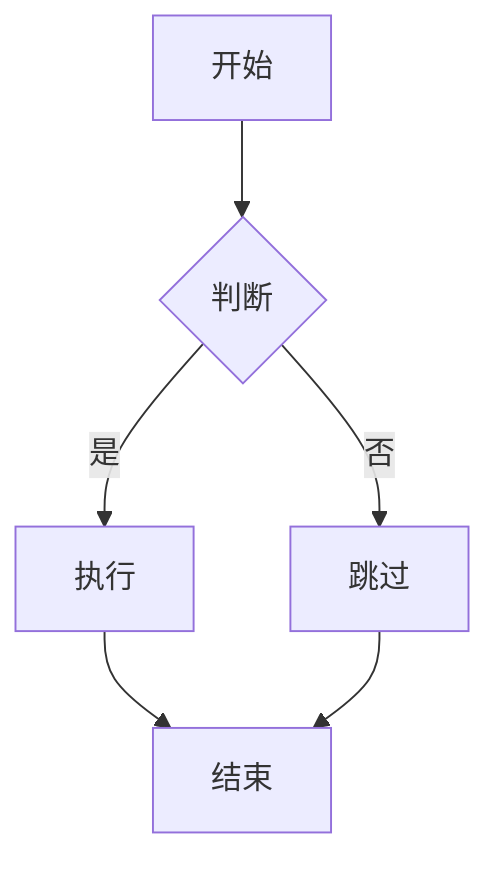
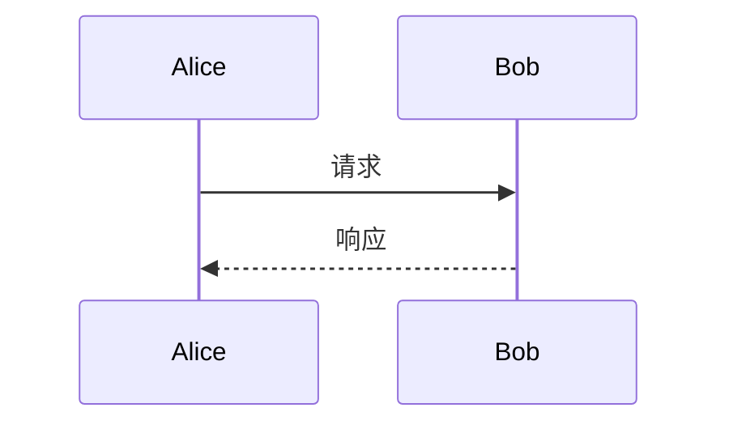
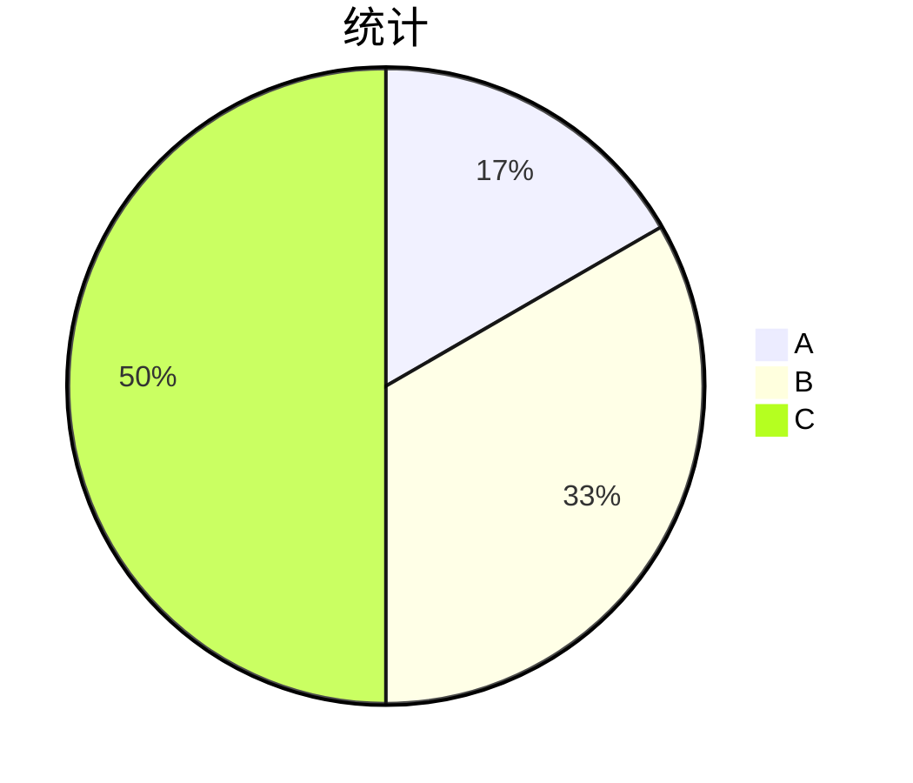

# 测试文档

这是一个用于测试 Mermaid Extractor 的文档。

## 流程图

```mermaid
graph TD
    A[开始] --> B{判断}
    B -->|是| C[执行]
    B -->|否| D[跳过]
    C --> E[结束]
    D --> E
```

## 序列图

```mermaid
sequenceDiagram
    Alice->>Bob: 请求
    Bob-->>Alice: 响应
```

## 无标题图表

```mermaid
pie title 统计
    "A": 10
    "B": 20
    "C": 30
```
